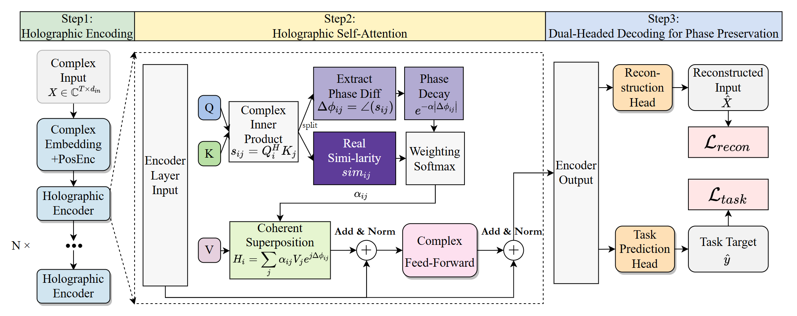

# Holographic Transformers for Complex-Valued Signal Processing: Integrating Phase Interference into Self-Attention 	

A PyTorch implementation of **Holographic Transformers** that integrate phase interference into self-attention mechanisms for complex-valued signal processing.

## Pipeline



## Key Features

- **Complex-valued neural networks** with proper gradient computation
- **Phase interference** in attention mechanisms (constructive/destructive)
- **Coherence decay** based on phase differences
- **Coherent superposition** with phase rotation
- **Dual-head decoder** for reconstruction and analysis tasks
- **Comprehensive test suite** with 25+ unit tests

## Requirements

To install requirements:
```bash
pip install -r requirements.txt
```

Requirements include:
- Python 3.10+
- PyTorch ≥ 2.2 (for native complex number support)
- NumPy

## Directory Structure

Make sure the directory follows:
```
holo_transformer
├── examples
│   ├── minimal_train.py
│   └── visualize_attn.py
├── tests
│   ├── test_gradcheck.py
│   ├── test_interference.py
│   ├── test_invariance.py
│   ├── test_mask.py
│   └── test_shapes.py
├── attention.py
├── decoder.py
├── encoder.py
├── losses.py
├── model.py
├── modules.py
├── utils.py
├── pipeline.png
├── requirements.txt
└── README.md
```

## Quick Start

### Basic Usage

```python
import torch
from holo_transformer import HoloTransformer, set_seed

# Set device and seed
device = torch.device("cuda" if torch.cuda.is_available() else "cpu")
set_seed(42)

# Create model
model = HoloTransformer(
    d_input=8,          # Input feature dimension
    d_model=64,         # Model dimension  
    n_heads=4,          # Number of attention heads
    d_ff=128,           # Feed-forward dimension
    num_layers=3,       # Number of encoder layers
    task_type="classification",
    num_classes=2
).to(device)

# Complex input data [batch_size, seq_len, d_input]
batch_size, seq_len = 4, 16
x = torch.randn(batch_size, seq_len, 8, dtype=torch.cfloat).to(device)
y = torch.randint(0, 2, (batch_size,)).to(device)

# Forward pass
output = model(x, y=y, return_attn=True)

print(f"Reconstruction shape: {output.x_hat.shape}")  # [4, 16, 8] complex
print(f"Classification shape: {output.outputs.shape}")  # [4, 2] real
print(f"Total loss: {output.loss_dict['total']:.4f}")
```

## Model Architecture

### Core Innovation: Holographic Attention

The model implements phase interference in self-attention:

1. **Complex Inner Product**: `s_ij = ⟨Q_i, K_j⟩_c = Σ Q_i[d] · conj(K_j[d])`

2. **Phase Difference**: `Δφ_ij = angle(s_ij) = atan2(Im(s_ij), Re(s_ij))`

3. **Coherence Decay**: `W_ij = sim_ij/√d_k · exp(-α|Δφ_ij|)`

4. **Coherent Superposition**: `H_i = Σ α_ij · (V_j · exp(i·Δφ_ij))`

### Components

- **ComplexLinear**: Linear layers for complex tensors
- **ComplexLayerNorm**: Layer normalization for real/imaginary parts
- **HolographicMultiheadAttention**: Core attention with phase interference
- **HoloTransformerEncoder**: Multi-layer encoder with positional encoding
- **DualHeadDecoder**: Reconstruction + analysis heads

## Training Example

To train the model with synthetic complex-valued data:

```python
from holo_transformer import HoloTransformer, SyntheticComplexDataset
from torch.utils.data import DataLoader
import torch.optim as optim

# Create synthetic dataset
dataset = SyntheticComplexDataset(
    num_samples=1000,
    seq_len=16,
    d_input=8,
    noise_level=0.1
)

dataloader = DataLoader(dataset, batch_size=32, shuffle=True)

# Create model and optimizer
model = HoloTransformer(d_input=8, d_model=64, n_heads=4, d_ff=128, num_layers=3)
optimizer = optim.Adam(model.parameters(), lr=1e-3)

# Training loop
for epoch in range(10):
    for batch_idx, (x, y) in enumerate(dataloader):
        # Forward pass
        output = model(x, y=y)
        loss = output.loss_dict['total']
        
        # Backward pass
        optimizer.zero_grad()
        loss.backward()
        optimizer.step()
        
        if batch_idx % 10 == 0:
            print(f"Epoch {epoch}, Batch {batch_idx}, Loss: {loss.item():.4f}")
```

## Running Tests

### Run All Tests
```bash
cd holo_transformer
python -m tests
```

### Run Specific Test Suites

Shape and dtype tests:
```bash
python tests/test_shapes.py
```

Padding mask tests:
```bash
python tests/test_mask.py
```

Phase invariance tests:
```bash
python tests/test_invariance.py
```

Interference behavior tests:
```bash
python tests/test_interference.py
```

Gradient computation tests:
```bash
python tests/test_gradcheck.py
```

## Examples

### Minimal Training
```bash
cd holo_transformer
python examples/minimal_train.py
```

### Attention Visualization
```bash
cd holo_transformer
python examples/visualize_attn.py
```
